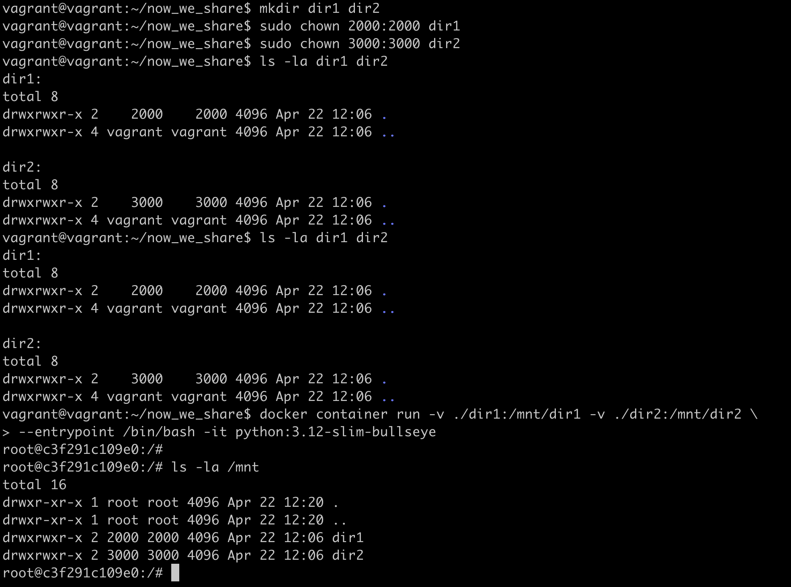
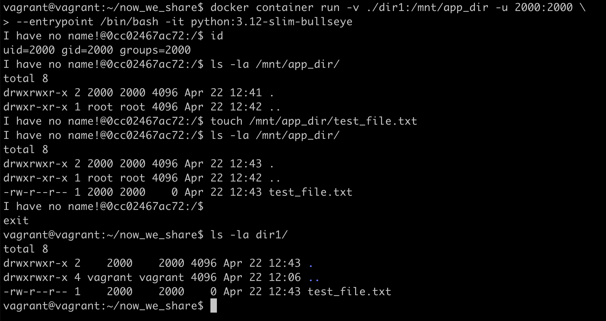
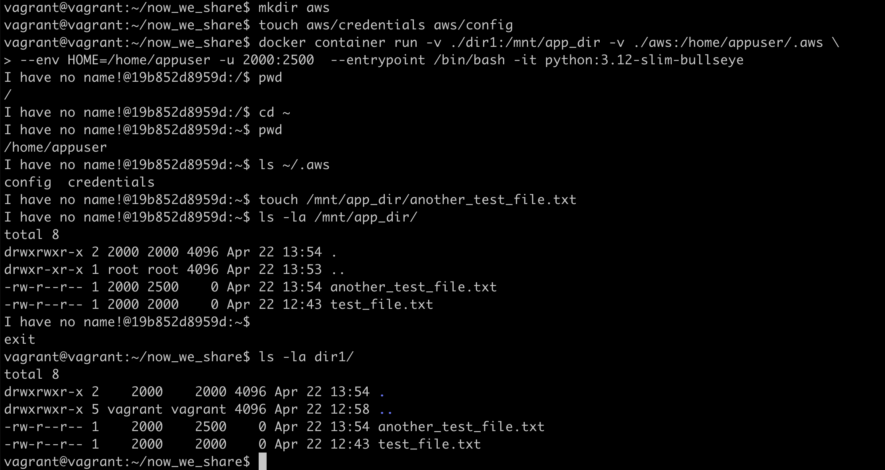

# Sharing Directories with Docker Containers

## Long Introduction

I have been working with Docker since 2017. By the moment I started,
many of my colleagues had already been using Docker for a while,
so I had to buy a copy of [Docker Deep Dive](https://www.goodreads.com/book/show/36411996-docker-deep-dive)
by Nigel Poulton and read it thoroughly through. The idea of abstracting
something complex into a container was very tempting, but it seemed that
many people considered Docker as a tool to abstract mainly web applications.
Almost any example I saw then was about a stateless service communicating
with a database system somewhere in the network, and the idea of writing
something anything onto disk from a container caused disapproving
glances from colleagues. I felt guiltiness when I asked someone about it.

For me, though, web applications were never the main focus of what I would
hide in a container. I mainly process text files, I write scripts that
read `stdin` or a directory and write to `stdout` or to another directory.
Thus, the question of how to share data between the host machine
and the container has always been with me. And until the previous week
everything had looked too complicated. By the way, somewhere in 2019
I had a chance to run some tasks on an HPC cluster and built for that some
[Singularity](https://docs.sylabs.io/guides/latest/user-guide/introduction.html)
containers. So I knew that this use case had always existed for containers,
but Docker didn't look like the right tool for that. Nevertheless, I have
been using Docker because people around me already use it, and I do not like
to introduce new tools without a good reason.

Making another approach several days ago I found an old
[ticket](https://github.com/moby/moby/issues/3124) and a quote from there
somehow blew my mind:

> Named volumes are initialized when first created to the contents of the image at the mount location. That
> initialization includes the owner and permissions.

At once, I wrote a small post about it, thinking that many people would
share my wonderment, but it turned out no one was interested. Later that day
I talked to a colleague at a coffee point and asked him whether he had any issues
with sharing data between the host machine and Docker containers; and it turned out
that he did at the very same moment. He had seen my post, but didn't see
that it somehow relates to his situation.

This new fact about initialization and the observation, that people might not see
its usefulness, took my thoughts for another hour. And then the fact about
initialization "clicked" suddenly and developed into the understanding that
the issue with sharing data between host and containers had never existed.
The only problem was that it had existed for me just several minutes before that,
and that I knew many people who still had the issue. They still have.

It seems I can shed some light.

## What is the matter?

It is hard to explain exactly where my misunderstanding did come from,
but here are some thoughts:

- By default, docker deamon runs containers from `root`. If you pass a shared
  directory to the container and create a file or a directory in there,
  it will be owned by `root:root` and you will need `sudo` to modify / delete
  the same files from the host system.
- If you are `root` in a running (linux) operating system, it is hard
  to switch to a non-existing user without modifying any files. The commands
  `adduser` and `addgroup` make some modifications on the disk. The container
  won't be stateless.
- When you run commands from a user, you frequently need to have some
  configuration files in the home directory, sometimes you need user-specific
  directories where the user stores intermediate files or caches. Not always
  it is clear whether you can configure the directories.
- If you need to write to a directory from a non-root, you will have to prepare
  the directory in advance (you need to either run chmod -R 777 or 666,
  or change the owner). It should either be the same user on the host
  and within the container, or they should share the group, but then
  you need to be sure that files are created with write permissions
  for the group.
- If you need to share results between several users on the host system,
  that group should be a common group for all those users. You might notice
  that you all are probably already members of the `docker` group.

As far as I can see, this is a typical chain of thought, which leads
to a docker build-time `USER_ID`, `USER_GID` environment variable, so that
you could prepare the corresponding user (using `adduser` and `addgroup`)
within the image and run the container with the same `-u $USER_ID:$USER_GID`
after that. There are several issues here, but the main is that the image
becomes hardly reusable. When you need to run the container from different users,
you have to rebuild the image before that.

It should be noted that the first created user is usually a user
with uid=1000 and gid=1000 and when you run the container on a fresh instance
in a cloud, this instance will usually have a 1000:1000 user as well. Because
of that, many developers are quite happy with building docker images with
the set-up 1000:1000 user and running containers with that user.

## A Better Approach

So, what was that thing that amazed me in the quote above? It was that I can now
set up owner and group permissions for my shared directories in a volume and attach
the volume to my container that needs those permissions. That changes the game
completely, you can now make pre-cooking in volumes instead of the Docker image.
It has its drawbacks, but allows to make the images reusable.

And next I realized the thing that had always been under my nose. It is not only
volumes are attached with set-up owner and group permissions. *Any directory you
attach to a container is attached with owner and group permissions of the host
system.* You don't need to run `chown` or `chmod` when you build the image at all.

Now some examples.

Let's create two directories `dir1` and `dir2` on our host system and change
ownership of the directories to some users with ids 2000 and 3000 and
the corresponding group ids. We don't have such users on our host system,
so `ls -la` shows us the ids when we list the directories.

Now we run a container from an official python image, attach the directories
to its `/mnt` directory and run `ls -la /mnt` from within the container.

As we expected! But we run the container from `root`.

Now let's use a less obvious observation: docker doesn't require the user
and the group to exist when you run the container with them. The prompt inside
the container will probably notify you that the user doesn't have a name, but
it will run without any issues. Here we run the container with uid=2000
and gid=2000 and make it create a file in the attached directory.

The last thing that we haven't yet addressed is the home directory
and the location of different configuration directories. Let's create
a directory which we want to attach as `~/.aws` within the container.
All we need is the directory and to define the `HOME` environment variable
under which we would mount our `.aws` directory.

## Conclusion

We can summarize the examples above into the following:

- You don't need to specifically prepare a directory on the host system,
  so that a container that you run could write into it, it just should exist.
- All you need to do is to pass the current user and the main group (`-u "$(id -u):$(id -g)"`).
- The directory where you mount the shared directory should be listable by `other`
  (`/root` is listable only by `root`, so you won't be able to write anything to its
  subdirectories, even you have full access to the subdirectory itself)
- `$HOME` can be the same for all possible users of the image or can be specified
  and mounted at runtime.

## Security note

I think it is clear now that the person who can run docker containers
with the default docker daemon settings can run anything on the host
machine with any permissions. If you don't want it to happen, you can
[remap](https://docs.docker.com/engine/security/userns-remap/) container
users to a range of users that do not overlap with the users on the host
machine and in other containers. But there are many scenarios
where the possibility to share data between the container and the host
machine can be useful.

